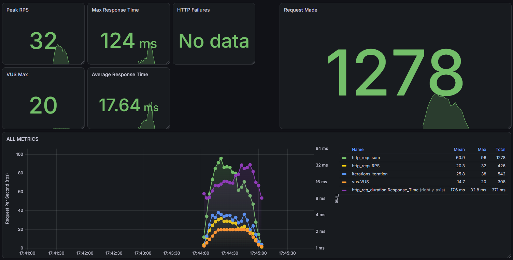

# 🚀 Automação de Testes | Portfólio QA

Este repositório consolida uma estratégia de qualidade de software aplicada a um ecossistema real e completo (Sistema de Gestão de Testes/TCC).

Fugindo de scripts frágeis em sites públicos de demonstração, este projeto utiliza uma aplicação _Full-Stack_ própria (React + Node.js/Prisma) como alvo. Isso garante um ambiente determinístico e demonstra domínio sobre a arquitetura do software, isolamento de dados e engenharia de testes contínuos.

## 🎯 Camadas de Validação e Stack Tecnológica

- **Testes de API (Postman & Newman):** Validação de contratos, _status codes_ e tempo de resposta. A suíte opera de forma encadeada (CRUD completo), utilizando herança de tokens JWT dinâmicos e limpeza de banco autônoma para não gerar lixo de dados.
- **Testes E2E (Playwright):** Automação do caminho crítico da interface gráfica aplicando estritamente o padrão de projeto _Page Object Model (POM)_ e localizadores blindados via `data-testid`.
- **Testes de Performance (k6):** Scripts de _Load Testing_ configurados com _thresholds_ para validar a estabilidade e mapear gargalos de infraestrutura nas rotas do backend.
- **Business Driven Development (Robot Framework):** Validação de regras de negócio complexas focada na clareza e rastreabilidade utilizando sintaxe _Keyword-driven_.
- **CI/CD & Relatórios:** Pipeline completa estruturada com GitHub Actions, orquestrando a subida do backend e banco de dados, reset de massa, execução dos testes (API + UI) e publicação contínua do relatório de qualidade no [GitHub Pages](https://entonymaxwell01.github.io/testes-projeto-tcc/).

## 📊 Monitoramento de Performance (Grafana + InfluxDB)

Os resultados dos testes de carga e estresse executados pelo **k6** são exportados em tempo real para o **InfluxDB** e visualizados através de um dashboard customizado no **Grafana**, permitindo o acompanhamento de métricas cruciais como VUs, latência (p95) e taxa de falhas.

  
   
  <em>Dashboard de Performance em tempo real durante o teste de load.</em>

